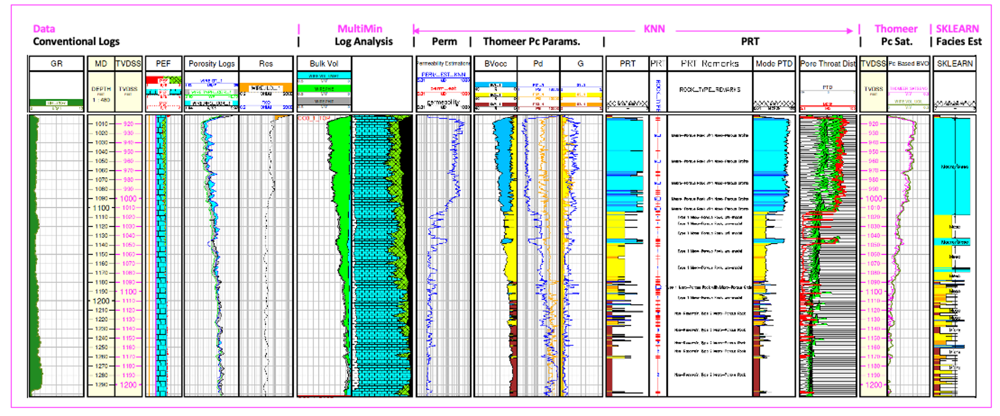
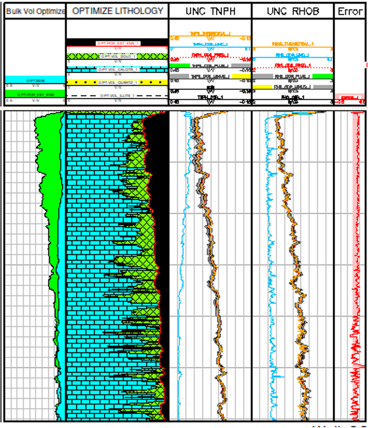
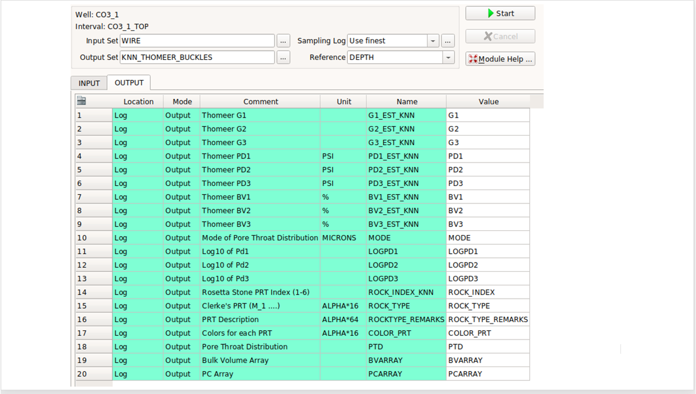
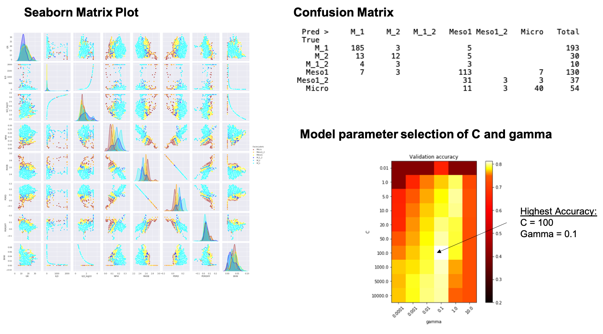

# Geolog used to automate the Carbonate characterization workflow using Clerke’s Arab D Rosetta Stone calibration data. This technique provides for a full pore system characterization with modeled Capillary Pressure saturations for an Arab D complex carbonate reservoir.

Geolog has always been found to be a user-friendly Petrophysical software tool that allows us to load, interrogate, process and display well log and production data. With the introduction of Geolog18, we can also use python code in our Geolog loglans to push the analysis even further.  Geolog python loglans can exploit state-of-the-art techniques in python to interrogate and build probabilistic methods to estimate additional well log curves, core analysis results, rock types, facies, engineering parameters and petrophysical properties.  

In this repository we include a comprehensive Geolog project with Geolog python loglans, data and one well to utilize a proven workflow to interrogate and characterize a typical Arab D carbonate reservoir in the project well. This example serves as the basis for a full-field reservoir characterization workflow for all wells throughout the entire field. In this example we are showing the results for just one well, but in the full-field reservoir characterization we would follow the same workflow and generate the same results for all wells run in batch mode for all wells. The final objective would be to use these well data results and create a 3D static model of porosity, permeability, Petrophysical Rock Types (PRT), capillary pressure parameters and saturations. Typically this static model would be used to initialize the dynamic model in reservoir simulation. 

This project demonstrates tried and proven workflow with the techniques as described by Phillips(1) et al. used in the characterization of most Arab D reservoirs in Saudi Arabia. Permeability, Petrophysical Rock Types (PRT), Capillary Pressure and modeled saturations are all estimated or calculated in this workflow in order to characterize this complex carbonate reservoir. Clerke’s(2) Arab D Rosetta Stone core analysis database is used as the calibration data. 

These calibration data are from Ed Clerke’s Rosetta Stone, Arab-D carbonate dataset from Ghawar field in Saudi Arabia. This is a very special carbonate dataset. Clerke randomly selected the final calibration samples from 1,000’s of core plugs for the final dataset.  The Rosetta Stone data cover the full range in poro-perm space and Petrophysical Rock Types (PRTs) observed in the Arab D reservoir. For each sample Clerke acquired High Pressure Mercury Injection (HPMI)  and fit the capillary pressure curves using a Thomeer hyperbola (see Altair Plot of Capillary Pressure curves) created from the Initial Displacement Pressure (Pdi), Pc curvature term Gi that relates to the variability of pore throats and Bulk Volume Occupied (BVocci) that is related to the Pore Volume for each pore system i.  From the results Clerke defined his Petrophysical Rock Types (PRT). For this Arab D reservoir, most PRTs have a dual-porosity system, and some PRTs have up to 3 pore systems. 

## Suggested Arab D Carbonate Workflow:
The following workflow and processing is suggested to interrogate, process, interpret and model the petrophysical properties of a typical Arab D carbonate reservoir using Clerke’s Arab D Rosetta Stone Carbonate database as calibration. The workflow consists of the following steps:

1) Interrogate the Well Log data and Rosetta Stone calibration data using standard Geolog layouts, cross plots and histograms and then use a python loglan featuring Altair, which is interactive software driven from a Geolog Module Launcher.

### Altair used to Interrogate the Rosetta Stone Thomeer Capillary Pressure curves and Petrophysical Rock Types (PRTs):

### Altair Used to Interrogate the Well log data in Geolog:

2) Run MultiMin for a solid log analysis model using the typical minerals found in the Arab D reservoir; Limestone, Dolomite, Anhydrite and Illite. With MultiMin we always use environmentally corrected log data and use the calculated uncertainties for each log curve employed in the analysis. 

To serve as an example we have created a python loglan that utilizes Scipy Optimize to estimate lithology:

    optimize_lith.pysh 
    
This loglan first uses digitized chartbook data as the basis for our kNN Porosity (PHIT) and Rho Matrix density calculations used in the analysis. Once we estimate PHIT, we then use Scipy Optimize (minimze) to estimate our carbonate lithology. 

Our primary function is the following in Scipy trying to estimate volumes of Calcite and Dolomite.

	fun = lambda x: (RHOB2 - (2.52*vol_illite + 2.71*x[0]+2.847*x[1]+PHIT*FD)) + (TNPH - (0.247*vol_illite + 0*x[0]+0.005*x[1]+PHIT*1))

Which is using two log response functions that are to be minimized:

	RHOB_theoretical =  2.52*vol_illite + 2.71*x[0]+2.847*x[1]+PHIT*FD

	TNPH_theoretical =  0.247*vol_illite + 0*x[0]+0.005*x[1]+PHIT*1

where res.x[0] = VOL_CALCITE and res.x[1] = VOL_DOLO. The objective is to minimize the difference between RHOB - RHOB_theoretical and TNPH - TNPH_theoretical while solving for our lithology. 

We would like to thank Andy McDonald and his Petrophysics Python Series for his examples and in particular we are using his hatch fill example in our optimization loglan.

This is all still considered work in progress, but please find below an example of the output.

3) Use available core data from the representative reservoir/field to build a petrophysical model to estimate permeability for all wells in field using our python loglan of kNN using normalized input data and weighted by Euclidean distances for each of the nearest neighbors. 

4) Using the kNN estimated permeability and calculated Total Porosity (PHIT) from MultiMin, we query Clerke’s Rosetta Stone core database to predict the following Petrophysical results also using kNN:
    - Petrophysical Rock Types (PRT) as defined by Clerke (M_1 Macro/Meso, M_2 Macro/Micro, M_1_2 Macro/Meso/Micro, Type1 Meso, Type 1_1 Meso/Micro and Type 2 Micro PRTs.
    - Thomeer Capillary Pressure parameters (Pdi, Gi and BVocci) for each pore system i over the reservoir interval

5) Use the Thomeer Capillary Pressure parameters to model saturations based on the buoyancy due to fluid density differences at the height above the Free Water Level (FWL). In this instance we compare the Bulk Volume Oil (BVO) from MultiMin vs. BVO from Thomeer-based capillary pressure saturations since BVO is pore volume weighted.

6) As a secondary technique to estimate PRTs, we also tested another applications in Geolog employing python’s Sklearn as published by Hall(3). We could have estimated Depositions of Environment or other types of categoric geologic facies used in this Sklearn prediction process. There is also a GitHub repository containing the Jypyter Notebook at the following link to use as a help file to understand the process and set model parameters: 

https://github.com/Philliec459/SKLEARN-used-to-predict-Petrophysical-Rock-Types-in-Arab-D-Carbonate

The same data used in Geolog can be evaluated within this Jupyter Notebook using Seaborn matrix plots, various types of a Confusion Matrix plots and the pick the SVM model C and gamma parameters from the Heat Map shown below. However, be sure to input the C_REG and GAMMA values in the Geolog python loglan using the most accurate C and gamma combination presented from the Heat Map.

## RESOURCES:
https://www.pdgm.com/products/geolog/

https://github.com/Philliec459?tab=repositories

https://github.com/Philliec459/SKLEARN-used-to-predict-Petrophysical-Rock-Types-in-Arab-D-Carbonate

1.	Phillips, E. C., Buiting, J. M., Clerke, E. A, “Full Pore System Petrophysical Characterization Technology for Complex Carbonate Reservoirs – Results from Saudi Arabia”, AAPG, 2009 Extended Abstract.
2.	Clerke, E. A., Mueller III, H. W., Phillips, E. C., Eyvazzadeh, R. Y., Jones, D. H., Ramamoorthy, R., Srivastava, A., (2008) “Application of Thomeer Hyperbolas to decode the pore systems, facies and reservoir properties of the Upper Jurassic Arab D Limestone, Ghawar field, Saudi Arabia: A Rosetta Stone approach”, GeoArabia, Vol. 13, No. 4, p. 113-160, October, 2008. 
3.	Hall, Brendon, “Facies classification using Machine Learning”, The Leading Edge, 2016, Volume 35, Issue 10
 
