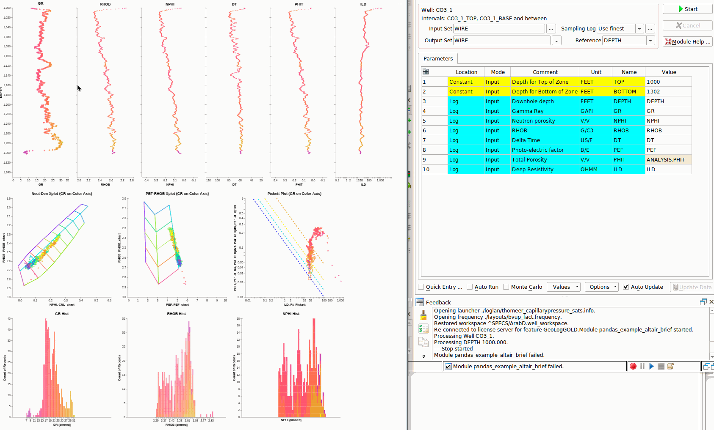

# Geolog used to automate the Carbonate characterization workflow using Clerke’s Arab D Rosetta Stone calibration data. This technique provides for a full pore system characterization with modeled Capillary Pressure saturations for an Arab D complex carbonate reservoir.

# INSTALL NOTE: Please delete any old GitHub subdirectory from this repository and definitely the old Geolog Project because we have had some major changes in the workflow with the addition of the handling of the Thomeer parameters and FWL Search routine. To install the Geolog project, delete the old ArabD_GitHub Geolog project, unzip the project in this repository and copy this 'new and improved' version of the Geolog project to your PG_PROJECTS location.

#### You will also need to have loaded the following python libraries installed in your Geolog PG_PYTHON_EXE site area:
- import geolog
- import pandas as pd
- import numpy as np
- import matplotlib.pyplot as plt
- import math
- from pandas import DataFrame, read_csv
- import altair as alt
- import altair_transform
- alt.renderers.enable('altair_viewer')
- alt.data_transformers.disable_max_rows()

## Introduction:
Geolog has always been found to be a user-friendly Petrophysical software tool that allows us to load, interrogate, process and display well log and production data. With the introduction of Geolog18, we can also use python code in our Geolog loglans to push the analysis even further.  Geolog python loglans can exploit state-of-the-art techniques in python to interrogate and build probabilistic methods to estimate additional well log curves, core analysis results, rock types, facies, engineering parameters and petrophysical properties.  

In this repository we include a comprehensive Geolog project with Geolog python loglans, data and one well to utilize a proven workflow to interrogate and characterize a typical Arab D carbonate reservoir in the project well. This example serves as the basis for a full-field reservoir characterization workflow for all wells throughout the entire field. In this example we are showing the results for just one well, but in the full-field reservoir characterization we would follow the same workflow and generate the same results for all wells run in batch mode for all wells. The final objective would be to use these well data results and create a 3D static model of porosity, permeability, Petrophysical Rock Types (PRT), capillary pressure parameters and saturations. Typically, this static model would be used to initialize the dynamic model in reservoir simulation. 

This project demonstrates tried and proven workflow with the techniques as described by Phillips(1) et al. used in the characterization of most Arab D reservoirs in Saudi Arabia. Permeability, Petrophysical Rock Types (PRT), Capillary Pressure and modeled saturations are all estimated or calculated in this workflow in order to characterize this complex carbonate reservoir. Clerke’s(2) Arab D Rosetta Stone core analysis database is used as the calibration data. 

These calibration data are from Ed Clerke’s Rosetta Stone, Arab-D carbonate dataset from Ghawar field in Saudi Arabia. This is a very special carbonate dataset. Clerke randomly selected the final calibration samples from 1,000’s of core plugs for the final dataset.  The Rosetta Stone data cover the full range in poro-perm space and Petrophysical Rock Types (PRTs) observed in the Arab D reservoir. For each sample Clerke acquired High Pressure Mercury Injection (HPMI)  and fit the capillary pressure curves using a Thomeer hyperbola (see Altair Plot of Capillary Pressure curves) created from the Initial Displacement Pressure (Pdi), Pc curvature term Gi that relates to the variability of pore throats and Bulk Volume Occupied (BVocci) that is related to the Pore Volume for each pore system i.  From the results Clerke defined his Petrophysical Rock Types (PRT). For this Arab D reservoir, most PRTs have a dual-porosity system, and some PRTs have up to 3 pore systems. 

## Suggested Arab D Carbonate Workflow:
The following workflow and processing is suggested to interrogate, process, interpret and model the petrophysical properties of a typical Arab D carbonate reservoir using Clerke’s Arab D Rosetta Stone Carbonate database as calibration. The workflow consists of the following steps:

1) Interrogate the Well Log data and Rosetta Stone calibration data using standard Geolog layouts, cross plots and histograms and then use a python loglan featuring Altair, which is interactive software driven from a Geolog Module Launcher.

### Altair Used to Interrogate the Well log data in Geolog:

		alt_logs.pysh

### Altair used to Interrogate the Rosetta Stone Thomeer Capillary Pressure curves and Petrophysical Rock Types (PRTs):

		altair_thoreer_parameters.pysh

2) Run MultiMin for a solid log analysis model using the typical minerals found in the Arab D reservoir; Limestone, Dolomite, Anhydrite and Illite. With MultiMin we always use environmentally corrected log data and use the calculated uncertainties for each log curve employed in the analysis. 

To serve as an example we have created a python loglan that utilizes Scipy Optimize to estimate lithology:

   		optimize_lith.pysh 
    
This loglan first uses digitized chartbook data as the basis for our kNN Porosity (PHIT) and Rho Matrix density calculations used in the analysis. Once we estimate PHIT, we then use Scipy Optimize (minimize) to estimate our carbonate lithology. 

Our primary function is the following in Scipy trying to estimate volumes of Calcite and Dolomite.

	fun = lambda x: (RHOB2 - (2.52*vol_illite + 2.71*x[0]+2.847*x[1]+PHIT*FD)) + (TNPH - (0.247*vol_illite + 0*x[0]+0.005*x[1]+PHIT*1))

Which is using two log response functions that are to be minimized:

	RHOB_theoretical =  2.52*vol_illite + 2.71*x[0]+2.847*x[1]+PHIT*FD

	TNPH_theoretical =  0.247*vol_illite + 0*x[0]+0.005*x[1]+PHIT*1

where res.x[0] = VOL_CALCITE and res.x[1] = VOL_DOLO. The objective is to minimize the difference between RHOB - RHOB_theoretical and TNPH - TNPH_theoretical while solving for our lithology. Please consider this still work in progress. There is much to learn on python Optimization. 

We would like to thank Andy McDonald and his Petrophysics Python Series for his examples and in particular we are using his hatch fill example in our optimization loglan.

Please find below an example of the output.

3) Use available core data from the representative reservoir/field to build a petrophysical model to estimate permeability for all wells in field using our python loglan of kNN using normalized input data and weighted by Euclidean distances for each of the nearest neighbors. 
	
		perm_knn.pysh

4) Using the kNN estimated permeability and calculated Total Porosity (PHIT) from MultiMin, we query Clerke’s Rosetta Stone core database to predict the Thomeer parameters;

		thomeer_parameters.pysh

 and a python loglan to predict the following Petrophysical Rock Types (PRT) also using kNN:
- Petrophysical Rock Types (PRT) as defined by Clerke (M_1 Macro/Meso, M_2 Macro/Micro, M_1_2 Macro/Meso/Micro, Type1 Meso, Type 1_1 Meso/Micro and Type 2 Micro PRTs.
- Thomeer Capillary Pressure parameters (Pdi, Gi and BVocci) for each pore system i over the reservoir interval

		thomeer_prt.pysh

5) Use the Thomeer Capillary Pressure parameters to model saturations based on the buoyancy due to fluid density differences at the height above the Free Water Level (FWL). In this instance we compare the Bulk Volume Oil (BVO) from MultiMin vs. BVO from Thomeer-based capillary pressure saturations since BVO is pore volume weighted. 

#### Free Water Level Search:
We have provided a FWL Search technique in python too to estimate the FWL elevation (TVDss) in each key well to be used to create a FWL plane for the field. 

		fwl_search.pysh

To model Capillary Pressure saturations, it is essential to have a proper Free Water Level (FWL). Reservoir Capillary Pressure or buoyancy is dependent upon the height above the FWL. 

On new discoveries the FWL is usually determined from Formation Test data plotting the pressure data vs. TVDss to find the intersection of the water gradient vs. hydrocarbon gradient. The elevation of this intersection is the FWL or zero Capillary Pressure. However, on older fields, this type of data is typically not available prior to pressure depletion and/or fluid contact movements in the field. Therefore, we need another way to estimate the FWL for the field. In the python software used in our Notebook we offer a FWL search technique that has been shown to work very well in numerous fields.

We perform this well-by-well FWL search by varying the FWL elevation from an estimated highest FWL to the lowest expected FWL (spill point...) for the reservoir.  We then calculate the error difference between the Bulk Volume Oil (BVO) from logs vs. BVO from Thomeer Capillary Pressure at each new FWL estimate for that well. The final fwl_est is the FWL estimated with the lowest Bulk Volume Oil (BVO) error for that well. This fwl_est is then used in our final Thomeer BVO Oil calculations.

The FWL search is usually run on all wells with a fwl_est for each well. In many instances in fields with large hydrocarbon columns, the wells near the crest will be too high above the FWL to give valid results. We have found that the wells near the edge usually give the best estimation.  However, those wells affected by water encroachment will also not give valid results. In the end it is usually a small percentage of wells near the edge of the field that will give valid FWL estimates that are consistent. The search results from these wells are then typically used to construct a plane in the 3D fine-grid model to represent the FWL for the field.

It should be noted, that not all FWL surfaces are flat. Structural tilting, subduction, and dynamic aquifers... can result in a tilted FWL elevations with the possibility of residual oil below the FWL, depending in the situation. 

We then estimate the Thomeer Capillary Pressure BVO using the FWL Search results and

		thomeer_pc_sats.phsy

to calculate our final estimatge of BVO using Capillary Pressure data. 

6) As a secondary technique to estimate PRTs, we also tested another applications in Geolog employing python’s Sklearn as published by Hall(3). We could have estimated Depositions of Environment or other types of categoric geologic facies used in this Sklearn prediction process. There is also a GitHub repository containing the Jypyter Notebook at the following link to use as a help file to understand the process and set model parameters: 

https://github.com/Philliec459/SKLEARN-used-to-predict-Petrophysical-Rock-Types-in-Arab-D-Carbonate

The same data used in Geolog can be evaluated within this Jupyter Notebook using Seaborn matrix plots, various types of a Confusion Matrix plots and the pick the SVM model C and gamma parameters from the Heat Map shown below. However, be sure to input the C_REG and GAMMA values in the Geolog python loglan using the most accurate C and gamma combination presented from the Heat Map.

## RESOURCES:
https://www.pdgm.com/products/geolog/

https://github.com/Philliec459?tab=repositories

https://github.com/Philliec459/SKLEARN-used-to-predict-Petrophysical-Rock-Types-in-Arab-D-Carbonate

1.	Phillips, E. C., Buiting, J. M., Clerke, E. A, “Full Pore System Petrophysical Characterization Technology for Complex Carbonate Reservoirs – Results from Saudi Arabia”, AAPG, 2009 Extended Abstract.
2.	Clerke, E. A., Mueller III, H. W., Phillips, E. C., Eyvazzadeh, R. Y., Jones, D. H., Ramamoorthy, R., Srivastava, A., (2008) “Application of Thomeer Hyperbolas to decode the pore systems, facies and reservoir properties of the Upper Jurassic Arab D Limestone, Ghawar field, Saudi Arabia: A Rosetta Stone approach”, GeoArabia, Vol. 13, No. 4, p. 113-160, October, 2008. 
3.	Hall, Brendon, “Facies classification using Machine Learning”, The Leading Edge, 2016, Volume 35, Issue 10
 
